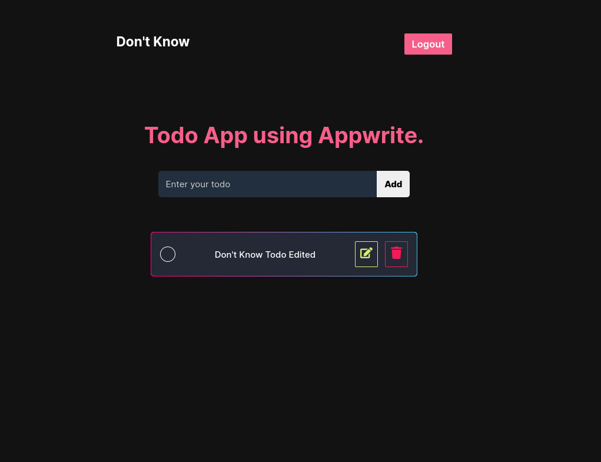

# Todo Crud in React

## Tech Stack

- Library :- ReactJS
- IDE :- vscode, neovim
- React Icons :- icons
- Appwrite :- Database management
- Typescript :- type checking

## How to run locally

1. First you have to create a account on appwrite, then create a projects, attributes for what your todo object will contain.
2. Copy your database id, collection id to the appwrite file.
3. Then clone or fork this repo, run the command `npm install` to install the dependencies, after that run the server using `npm run dev`.

### View the live Site here <ins>_[Live Site](https://todo-app-appwrite-typescript.vercel.app)_</ins>

## How UI looks like

### Home Page

### Login Page

### SignUp Page

